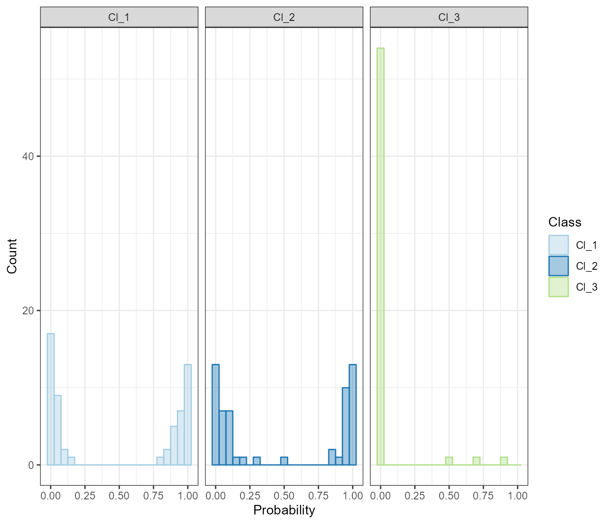

# Predictive Modeling using tuneTrain()

### Binary classification: balanced data

`septoriaDurumWC` dataset is used to illustrate the binary
classification of balanced data. This dataset includes monthly data for
3 climatic variables (tmin, tmax and precipitation), 19 bioclimatic
variables and evaluation of durum wheat accessions for Septoria Tritici.

The response to Septoria Tritici is labeled as `R` for `Resistant` and
`S` for `Susceptible`.

- **R (Resistant):** represents samples/observations that are resistant
  to Septoria. This level indicates the wheat genotypes or environmental
  conditions where Septoria’s impact is minimal or absent.
- **S (Susceptible):** represents samples/observations that are
  susceptible to Septoria. This level indicates the wheat genotypes or
  environmental conditions where Septoria’s impact is significant.

``` r
library(icardaFIGSr)
library(dplyr)
library(pROC)
library(caret)

# Load data sample
data("septoriaDurumWC")

# Check data is balanced
septoriaDurumWC |>
  count(ST_S)
#> # A tibble: 2 × 2
#>   ST_S      n
#>   <fct> <int>
#> 1 R       106
#> 2 S        94

## Run binary classification of ST_S with balanced data
knn.ST_S <- tuneTrain(data = as.data.frame(septoriaDurumWC),
                      y =  'ST_S',
                      method = 'knn', # using knn algorithm
                      summary = multiClassSummary, # Important for classification tasks
                      repeats = 3,
                      classProbs = TRUE) # also important for classification tasks
#> k-Nearest Neighbors 
#> 
#> 141 samples
#>  55 predictor
#>   2 classes: 'R', 'S' 
#> 
#> Pre-processing: centered (55), scaled (55) 
#> Resampling: Cross-Validated (10 fold, repeated 3 times) 
#> Summary of sample sizes: 127, 128, 128, 127, 126, 126, ... 
#> Resampling results across tuning parameters:
#> 
#>   k   logLoss    AUC        prAUC      Accuracy   Kappa      F1       
#>    5  2.2616126  0.6500709  0.4828789  0.6260562  0.2572795  0.6009026
#>    7  1.4423420  0.6460530  0.5016384  0.6289377  0.2653482  0.5986522
#>    9  1.2328555  0.6360261  0.5097475  0.6247009  0.2577766  0.5951461
#>   11  1.0782278  0.6340632  0.5203342  0.6095726  0.2262241  0.5750704
#>   13  0.6905751  0.6438209  0.5202541  0.6143590  0.2375240  0.5794117
#>   15  0.6884231  0.6386621  0.5269275  0.6119536  0.2314113  0.5749646
#>   17  0.6793789  0.6402778  0.5203508  0.6068254  0.2211182  0.5725103
#>   19  0.6735896  0.6417304  0.5173074  0.6117460  0.2347800  0.5645023
#>   21  0.6639009  0.6502480  0.5136864  0.6093407  0.2294590  0.5623978
#>   23  0.6628867  0.6429422  0.5271042  0.6024908  0.2168394  0.5522164
#>   Sensitivity  Specificity  Pos_Pred_Value  Neg_Pred_Value  Precision
#>   0.5541667    0.7047619    0.6948545       0.5858345       0.6948545
#>   0.5398810    0.7277778    0.7046693       0.5854978       0.7046693
#>   0.5315476    0.7293651    0.6987698       0.5804389       0.6987698
#>   0.5172619    0.7119048    0.6892593       0.5665308       0.6892593
#>   0.5172619    0.7238095    0.6871825       0.5720010       0.6871825
#>   0.5119048    0.7214286    0.6844048       0.5691414       0.6844048
#>   0.5166667    0.7055556    0.6712302       0.5682552       0.6712302
#>   0.4898810    0.7476190    0.6959524       0.5685281       0.6959524
#>   0.4851190    0.7468254    0.7012698       0.5632900       0.7012698
#>   0.4720238    0.7476190    0.7046429       0.5555568       0.7046429
#>   Recall     Detection_Rate  Balanced_Accuracy
#>   0.5541667  0.2938706       0.6294643        
#>   0.5398810  0.2867033       0.6338294        
#>   0.5315476  0.2819414       0.6304563        
#>   0.5172619  0.2748230       0.6145833        
#>   0.5172619  0.2746398       0.6205357        
#>   0.5119048  0.2722589       0.6166667        
#>   0.5166667  0.2744811       0.6111111        
#>   0.4898810  0.2603053       0.6187500        
#>   0.4851190  0.2577411       0.6159722        
#>   0.4720238  0.2507326       0.6098214        
#> 
#> Accuracy was used to select the optimal model using the largest value.
#> The final value used for the model was k = 7.
#> k-Nearest Neighbors 
#> 
#> 141 samples
#>  55 predictor
#>   2 classes: 'R', 'S' 
#> 
#> Pre-processing: centered (55), scaled (55) 
#> Resampling: Cross-Validated (10 fold, repeated 3 times) 
#> Summary of sample sizes: 127, 127, 127, 128, 127, 126, ... 
#> Resampling results across tuning parameters:
#> 
#>   k  logLoss   AUC        prAUC      Accuracy   Kappa      F1       
#>   5  2.117061  0.6671840  0.4985782  0.6319414  0.2684773  0.6033431
#>   6  1.214363  0.6505385  0.4905817  0.6425031  0.2893426  0.6199563
#>   7  1.146843  0.6472222  0.4918258  0.6181319  0.2426935  0.5871552
#>   8  1.160049  0.6324192  0.4919960  0.6131868  0.2341963  0.5837480
#>   9  1.159630  0.6238308  0.4998371  0.6082418  0.2230264  0.5791040
#>   Sensitivity  Specificity  Pos_Pred_Value  Neg_Pred_Value  Precision
#>   0.5517857    0.7214286    0.7167328       0.5934367       0.7167328
#>   0.5690476    0.7253968    0.7253836       0.5990717       0.7253836
#>   0.5297619    0.7166667    0.7049206       0.5769481       0.7049206
#>   0.5351190    0.7031746    0.6975998       0.5739165       0.6975998
#>   0.5291667    0.6984127    0.6915873       0.5684466       0.6915873
#>   Recall     Detection_Rate  Balanced_Accuracy
#>   0.5517857  0.2940659       0.6366071        
#>   0.5690476  0.3030891       0.6472222        
#>   0.5297619  0.2820024       0.6232143        
#>   0.5351190  0.2843834       0.6191468        
#>   0.5291667  0.2819780       0.6137897        
#> 
#> Accuracy was used to select the optimal model using the largest value.
#> The final value used for the model was k = 6.
```

Let’s explore the results..

``` r
# Plot class probabilities
knn.ST_S$`Class Probabilities Plot`
```


Class Probabilities for ST_S using KNN

``` r
# ROC plot
knn.ST_S$ROC_Plot
```


Roc Plot for ST_S using KNN

``` r
# Variable importance
knn.ST_S$VariableImportance
```


Variable Importance for ST_S using KNN

``` r
# Model quality
knn.ST_S$`Model quality`
#> Confusion Matrix and Statistics
#> 
#>           Reference
#> Prediction  R  S
#>          R 20  8
#>          S 11 20
#>                                           
#>                Accuracy : 0.678           
#>                  95% CI : (0.5436, 0.7938)
#>     No Information Rate : 0.5254          
#>     P-Value [Acc > NIR] : 0.01262         
#>                                           
#>                   Kappa : 0.3576          
#>                                           
#>  Mcnemar's Test P-Value : 0.64636         
#>                                           
#>             Sensitivity : 0.6452          
#>             Specificity : 0.7143          
#>          Pos Pred Value : 0.7143          
#>          Neg Pred Value : 0.6452          
#>              Prevalence : 0.5254          
#>          Detection Rate : 0.3390          
#>    Detection Prevalence : 0.4746          
#>       Balanced Accuracy : 0.6797          
#>                                           
#>        'Positive' Class : R               
#> 

# Training object
knn.ST_S$Training
#> k-Nearest Neighbors 
#> 
#> 141 samples
#>  55 predictor
#>   2 classes: 'R', 'S' 
#> 
#> Pre-processing: centered (55), scaled (55) 
#> Resampling: Cross-Validated (10 fold, repeated 3 times) 
#> Summary of sample sizes: 127, 127, 127, 128, 127, 126, ... 
#> Resampling results across tuning parameters:
#> 
#>   k  logLoss   AUC        prAUC      Accuracy   Kappa      F1       
#>   5  2.117061  0.6671840  0.4985782  0.6319414  0.2684773  0.6033431
#>   6  1.214363  0.6505385  0.4905817  0.6425031  0.2893426  0.6199563
#>   7  1.146843  0.6472222  0.4918258  0.6181319  0.2426935  0.5871552
#>   8  1.160049  0.6324192  0.4919960  0.6131868  0.2341963  0.5837480
#>   9  1.159630  0.6238308  0.4998371  0.6082418  0.2230264  0.5791040
#>   Sensitivity  Specificity  Pos_Pred_Value  Neg_Pred_Value  Precision
#>   0.5517857    0.7214286    0.7167328       0.5934367       0.7167328
#>   0.5690476    0.7253968    0.7253836       0.5990717       0.7253836
#>   0.5297619    0.7166667    0.7049206       0.5769481       0.7049206
#>   0.5351190    0.7031746    0.6975998       0.5739165       0.6975998
#>   0.5291667    0.6984127    0.6915873       0.5684466       0.6915873
#>   Recall     Detection_Rate  Balanced_Accuracy
#>   0.5517857  0.2940659       0.6366071        
#>   0.5690476  0.3030891       0.6472222        
#>   0.5297619  0.2820024       0.6232143        
#>   0.5351190  0.2843834       0.6191468        
#>   0.5291667  0.2819780       0.6137897        
#> 
#> Accuracy was used to select the optimal model using the largest value.
#> The final value used for the model was k = 6.

# Tuning object
knn.ST_S$Tuning
#> k-Nearest Neighbors 
#> 
#> 141 samples
#>  55 predictor
#>   2 classes: 'R', 'S' 
#> 
#> Pre-processing: centered (55), scaled (55) 
#> Resampling: Cross-Validated (10 fold, repeated 3 times) 
#> Summary of sample sizes: 127, 128, 128, 127, 126, 126, ... 
#> Resampling results across tuning parameters:
#> 
#>   k   logLoss    AUC        prAUC      Accuracy   Kappa      F1       
#>    5  2.2616126  0.6500709  0.4828789  0.6260562  0.2572795  0.6009026
#>    7  1.4423420  0.6460530  0.5016384  0.6289377  0.2653482  0.5986522
#>    9  1.2328555  0.6360261  0.5097475  0.6247009  0.2577766  0.5951461
#>   11  1.0782278  0.6340632  0.5203342  0.6095726  0.2262241  0.5750704
#>   13  0.6905751  0.6438209  0.5202541  0.6143590  0.2375240  0.5794117
#>   15  0.6884231  0.6386621  0.5269275  0.6119536  0.2314113  0.5749646
#>   17  0.6793789  0.6402778  0.5203508  0.6068254  0.2211182  0.5725103
#>   19  0.6735896  0.6417304  0.5173074  0.6117460  0.2347800  0.5645023
#>   21  0.6639009  0.6502480  0.5136864  0.6093407  0.2294590  0.5623978
#>   23  0.6628867  0.6429422  0.5271042  0.6024908  0.2168394  0.5522164
#>   Sensitivity  Specificity  Pos_Pred_Value  Neg_Pred_Value  Precision
#>   0.5541667    0.7047619    0.6948545       0.5858345       0.6948545
#>   0.5398810    0.7277778    0.7046693       0.5854978       0.7046693
#>   0.5315476    0.7293651    0.6987698       0.5804389       0.6987698
#>   0.5172619    0.7119048    0.6892593       0.5665308       0.6892593
#>   0.5172619    0.7238095    0.6871825       0.5720010       0.6871825
#>   0.5119048    0.7214286    0.6844048       0.5691414       0.6844048
#>   0.5166667    0.7055556    0.6712302       0.5682552       0.6712302
#>   0.4898810    0.7476190    0.6959524       0.5685281       0.6959524
#>   0.4851190    0.7468254    0.7012698       0.5632900       0.7012698
#>   0.4720238    0.7476190    0.7046429       0.5555568       0.7046429
#>   Recall     Detection_Rate  Balanced_Accuracy
#>   0.5541667  0.2938706       0.6294643        
#>   0.5398810  0.2867033       0.6338294        
#>   0.5315476  0.2819414       0.6304563        
#>   0.5172619  0.2748230       0.6145833        
#>   0.5172619  0.2746398       0.6205357        
#>   0.5119048  0.2722589       0.6166667        
#>   0.5166667  0.2744811       0.6111111        
#>   0.4898810  0.2603053       0.6187500        
#>   0.4851190  0.2577411       0.6159722        
#>   0.4720238  0.2507326       0.6098214        
#> 
#> Accuracy was used to select the optimal model using the largest value.
#> The final value used for the model was k = 7.
```

> *Note the difference between Model Training and Tuning objects at the
> end of the output. The final hyperparameter value is different (6 vs
> 7).*

``` r
# You can also access the training and testing datasets from the resulted list
knn.ST_S$`Training Data`
knn.ST_S$`Test Data` 
```

### Binary classification: imbalanced data

`BarleyRNOWC` dataset is used to illustrate the binary classification of
imbalanced data, with the purpose of modeling the response
classification of barley Kernel row number type to climate variables.

The response variable RNO categorizes barley into the following levels:

- **1 (Six-rowed):** represents barley genotypes with six distinct rows
  of kernels on the spike.
- **2 (Two-rowed):** represents barley genotypes with two distinct rows
  of kernels on the spike.
- **3 (Two-rowed - rudimentary florets):** represents two-rowed barley
  with underdeveloped or rudimentary florets.
- **4 (Irregular lateral florets):** represents barley genotypes with
  irregularly developed lateral florets on the spike.
- **5 (Irregular: 2 and 6 rows):** represents heterogeneous genotypes
  showing spikes with both two-rowed and six-rowed characteristics.
- **10 (Heterogeneous):** represents a genetically diverse group with
  mixed spike structures.

For this example, we use only the first 2 categories : `six-rowed`
(cl_1) and `two-rowed` (cl_2).

``` r
# Load sample data
data(BarleyRNOWC)

# Count classes for data imbalance check
BarleyRNOWC %>%
  count(RNO)
#>   RNO   n
#> 1   1 170
#> 2   2  30

## Binary classification of RNO
rf.RNO <- tuneTrain(data = BarleyRNOWC,
                      y = 'RNO',
                      method = 'rf',
                      summary = multiClassSummary,
                      imbalanceMethod = "up",
                      process = c("scale", "center"),
                      classProbs = TRUE,
                      repeats = 3)
#> Random Forest 
#> 
#> 140 samples
#>  55 predictor
#>   2 classes: 'Cl_1', 'Cl_2' 
#> 
#> Pre-processing: scaled (55), centered (55) 
#> Resampling: Cross-Validated (10 fold, repeated 3 times) 
#> Summary of sample sizes: 126, 126, 126, 126, 126, 126, ... 
#> Addtional sampling using up-sampling prior to pre-processing
#> 
#> Resampling results across tuning parameters:
#> 
#>   mtry  logLoss   AUC        prAUC      Accuracy   Kappa      F1       
#>    2    1.436070  0.7476852  0.4196864  0.7865690  0.3195494  0.8640164
#>    7    1.514558  0.7419613  0.4360995  0.7789255  0.2284394  0.8633581
#>   13    1.870873  0.7203914  0.4096570  0.7578144  0.1728108  0.8493871
#>   19    1.501019  0.7403830  0.4364434  0.7569475  0.2059739  0.8456626
#>   25    1.793648  0.7391414  0.4262912  0.7835043  0.2397354  0.8661214
#>   31    1.802653  0.7130051  0.4081247  0.7761783  0.2400216  0.8594466
#>   37    1.711508  0.7451599  0.4158203  0.7552503  0.1921877  0.8454244
#>   43    1.690353  0.7302189  0.4299397  0.7715995  0.2365599  0.8559213
#>   49    1.671412  0.7347222  0.4131576  0.7867521  0.2524940  0.8679252
#>   55    1.746767  0.7247896  0.4243801  0.7622589  0.1919837  0.8517818
#>   Sensitivity  Specificity  Pos_Pred_Value  Neg_Pred_Value  Precision
#>   0.8318182    0.5277778    0.9104511       0.4520525       0.9104511
#>   0.8401515    0.4388889    0.8968864       0.3402211       0.8968864
#>   0.8234848    0.3833333    0.8857779       0.3014778       0.8857779
#>   0.8116162    0.4500000    0.8972484       0.3188776       0.8972484
#>   0.8457071    0.4333333    0.8972749       0.3818878       0.8972749
#>   0.8313131    0.4555556    0.9020781       0.3687925       0.9020781
#>   0.8121212    0.4277778    0.8931469       0.3041667       0.8931469
#>   0.8229798    0.4722222    0.9050126       0.3539116       0.9050126
#>   0.8431818    0.4611111    0.9030042       0.3508730       0.9030042
#>   0.8204545    0.4277778    0.8957248       0.3015306       0.8957248
#>   Recall     Detection_Rate  Balanced_Accuracy
#>   0.8318182  0.7076068       0.6797980        
#>   0.8401515  0.7142491       0.6395202        
#>   0.8234848  0.7002808       0.6034091        
#>   0.8116162  0.6898901       0.6308081        
#>   0.8457071  0.7190110       0.6395202        
#>   0.8313131  0.7068987       0.6434343        
#>   0.8121212  0.6907570       0.6199495        
#>   0.8229798  0.6999389       0.6476010        
#>   0.8431818  0.7173138       0.6521465        
#>   0.8204545  0.6975824       0.6241162        
#> 
#> Accuracy was used to select the optimal model using the largest value.
#> The final value used for the model was mtry = 49.
#> Random Forest 
#> 
#> 140 samples
#>  55 predictor
#>   2 classes: 'Cl_1', 'Cl_2' 
#> 
#> Pre-processing: scaled (55), centered (55) 
#> Resampling: Cross-Validated (10 fold, repeated 3 times) 
#> Summary of sample sizes: 126, 125, 126, 126, 126, 126, ... 
#> Addtional sampling using up-sampling prior to pre-processing
#> 
#> Resampling results across tuning parameters:
#> 
#>   mtry  logLoss   AUC        prAUC      Accuracy   Kappa      F1       
#>   47    1.639892  0.7233375  0.4345348  0.7672894  0.2207960  0.8521266
#>   48    1.839672  0.7059764  0.4269922  0.7626862  0.2206060  0.8479758
#>   49    1.871368  0.7000842  0.4059849  0.7533455  0.2023018  0.8421738
#>   50    1.613479  0.7179082  0.4225698  0.7552259  0.2085086  0.8434495
#>   51    1.574021  0.7051136  0.4182123  0.7484005  0.2156166  0.8369782
#>   Sensitivity  Specificity  Pos_Pred_Value  Neg_Pred_Value  Precision
#>   0.8270202    0.4277778    0.8916624       0.3439153       0.8916624
#>   0.8184343    0.4444444    0.8910499       0.3232143       0.8910499
#>   0.8131313    0.4166667    0.8865795       0.3388889       0.8865795
#>   0.8128788    0.4333333    0.8900126       0.3142036       0.8900126
#>   0.7962121    0.4833333    0.8989118       0.3174320       0.8989118
#>   Recall     Detection_Rate  Balanced_Accuracy
#>   0.8270202  0.7032723       0.6273990        
#>   0.8184343  0.6961050       0.6314394        
#>   0.8131313  0.6913675       0.6148990        
#>   0.8128788  0.6908669       0.6231061        
#>   0.7962121  0.6768987       0.6397727        
#> 
#> Accuracy was used to select the optimal model using the largest value.
#> The final value used for the model was mtry = 47.

# same outputs of binary classification task
names(rf.RNO)
#> [1] "Tuning"                   "Training"                
#> [3] "Model quality"            "VariableImportance"      
#> [5] "ROC_Plot"                 "Class Probabilities"     
#> [7] "Class Probabilities Plot" "Training Data"           
#> [9] "Test Data"
```

``` r
## Plot class probabilities
rf.RNO$`Class Probabilities Plot`
```


Class Probabilities for RNO using Random Forest

``` r
## ROC plot
rf.RNO$ROC_Plot
```


Roc Plot for RNO using Random Forest

``` r
## Variable importance
rf.RNO$VariableImportance
```


Variable Importance for RNO using Random Forest

### Regression

`DurumWheatDHEWC` dataset is designed for modeling climate impacts on
the days to heading (DHE) of durum wheat. It contains multiple columns
representing climate variables, which are used as predictors, and a
numeric response variable, DHE, which indicates the number of days
required for durum wheat to reach the heading stage.

``` r
# Load sample data for regression task
data("DurumWheatDHEWC")

## Regression of DHE (days to heading)
svm.DHE <- tuneTrain(data = DurumWheatDHEWC,
                      y =  'DHE',
                      method = 'svmLinear2',
                      summary = defaultSummary,
                      classProbs = FALSE,
                      repeats = 3)
#> Support Vector Machines with Linear Kernel 
#> 
#> 137 samples
#>  55 predictor
#> 
#> Pre-processing: centered (55), scaled (55) 
#> Resampling: Cross-Validated (10 fold, repeated 3 times) 
#> Summary of sample sizes: 124, 123, 123, 123, 124, 123, ... 
#> Resampling results across tuning parameters:
#> 
#>   cost    RMSE      Rsquared   MAE     
#>     0.25  4.392096  0.3874978  3.424457
#>     0.50  4.422735  0.3944809  3.404364
#>     1.00  4.471461  0.3923094  3.438605
#>     2.00  4.482016  0.3909093  3.431474
#>     4.00  4.629627  0.3641357  3.506504
#>     8.00  4.758136  0.3525155  3.548093
#>    16.00  4.962108  0.3316333  3.682896
#>    32.00  5.135696  0.3130516  3.818127
#>    64.00  5.209299  0.3139861  3.880438
#>   128.00  5.265016  0.3096848  3.924131
#> 
#> RMSE was used to select the optimal model using the smallest value.
#> The final value used for the model was cost = 0.25.
#> Support Vector Machines with Linear Kernel 
#> 
#> 137 samples
#>  55 predictor
#> 
#> Pre-processing: centered (55), scaled (55) 
#> Resampling: Cross-Validated (10 fold, repeated 3 times) 
#> Summary of sample sizes: 123, 123, 124, 123, 123, 124, ... 
#> Resampling results across tuning parameters:
#> 
#>   cost  RMSE      Rsquared   MAE     
#>   0.25  4.374473  0.3888565  3.404007
#>   0.50  4.346750  0.4006997  3.346334
#>   0.75  4.348030  0.4065156  3.333252
#>   1.00  4.343706  0.4094038  3.314261
#>   1.25  4.350663  0.4096769  3.308364
#> 
#> RMSE was used to select the optimal model using the smallest value.
#> The final value used for the model was cost = 1.

# Regression outputs
names(svm.DHE)
#> [1] "Tuning"                       "Training"                    
#> [3] "Predictions"                  "Residuals Vs. Predicted Plot"
#> [5] "Predicted vs Actual Plot"     "Quality_metrics"             
#> [7] "VariableImportance"           "Training Data"               
#> [9] "Test Data"
```

``` r
svm.DHE$VariableImportance
```


Variable Importance for DHE

``` r
svm.DHE$Quality_metrics
#>      RMSE  Rsquared       MAE 
#> 4.3359347 0.3971378 3.4593691
svm.DHE$`Predicted vs Actual Plot`
```


Predicted vs Actual DHE

``` r
svm.DHE$`Residuals Vs. Predicted Plot`
```


Residuals vs predicted DHE

### Multiclass classification

In this case, we use the same `DurumWheatDHEWC` dataset to create days
to heading classes variable (DHE_Class) to fit a multiclass model.
DHE_classes are descibed as follows:

- **1 (Early):** Represents samples/observations with early days to
  heading, indicating adaptability to shorter growing seasons or
  favorable early-season conditions.
- **2 (Intermediate):** Represents samples/observations with moderate
  days to heading, indicating typical or average responses under given
  environmental conditions.
- **3 (Late):** Represents samples/observations with late days to
  heading, suggesting adaptability to longer growing seasons or
  late-season conditions.

``` r
# Create DHE Classes from DurumWheatDHEWC dataset
DurumWheatDHEWC$DHE_class <- ifelse(
  DurumWheatDHEWC$DHE <= 172, "1",
  ifelse(DurumWheatDHEWC$DHE <= 180, "2", "3")
 )
 
# Convert to factor 
DurumWheatDHEWC$DHE_class <- factor(DurumWheatDHEWC$DHE_class)
   
# Count classes for data imbalance check
DurumWheatDHEWC %>%
   count(DHE_class)
#>   DHE_class  n
#> 1         1 96
#> 2         2 87
#> 3         3 10
```

``` r
## Run Multiclass Classification
rf.DHE_class <- tuneTrain(data = DurumWheatDHEWC,
                              y =  'DHE_class',
                              method = 'rf',
                              parallelComputing = FALSE,
                              summary = multiClassSummary,
                              imbalanceMethod ="up", # Here we upsample the less represented class (3)
                              classProbs = TRUE,
                              repeats = 3)
#> Random Forest 
#> 
#> 136 samples
#>  56 predictor
#>   3 classes: 'Cl_1', 'Cl_2', 'Cl_3' 
#> 
#> Pre-processing: centered (56), scaled (56) 
#> Resampling: Cross-Validated (10 fold, repeated 3 times) 
#> Summary of sample sizes: 124, 122, 122, 123, 123, 122, ... 
#> Addtional sampling using up-sampling prior to pre-processing
#> 
#> Resampling results across tuning parameters:
#> 
#>   mtry  logLoss       AUC        prAUC       Accuracy   Kappa      Mean_F1  
#>    2    0.5939983806  0.8747295  0.57783406  0.7183761  0.4776484  0.6151515
#>    8    0.3316253502  0.9771833  0.63240857  0.9121551  0.8351317  0.9521368
#>   14    0.2037479108  0.9997685  0.64667108  0.9508242  0.9074325  0.9871286
#>   20    0.1289448417  1.0000000  0.63822751  0.9805556  0.9641291  0.9909143
#>   26    0.0835792340  1.0000000  0.61626984  0.9976190  0.9957958  0.9975580
#>   32    0.0502943362  1.0000000  0.62063492  1.0000000  1.0000000  1.0000000
#>   38    0.0306568539  1.0000000  0.60740741  1.0000000  1.0000000  1.0000000
#>   44    0.0150253649  1.0000000  0.51441799  1.0000000  1.0000000  1.0000000
#>   50    0.0059382328  1.0000000  0.35661376  1.0000000  1.0000000  1.0000000
#>   56    0.0000245667  1.0000000  0.01111111  1.0000000  1.0000000  1.0000000
#>   Mean_Sensitivity  Mean_Specificity  Mean_Pos_Pred_Value  Mean_Neg_Pred_Value
#>   0.5215420         0.8302096         0.4950491            0.8493366          
#>   0.7127740         0.9468254         0.9476190            0.9539387          
#>   0.8435374         0.9700397         0.9890873            0.9783321          
#>   0.9297052         0.9884259         0.9922969            0.9899534          
#>   0.9977324         0.9986111         0.9977324            0.9980159          
#>   1.0000000         1.0000000         1.0000000            1.0000000          
#>   1.0000000         1.0000000         1.0000000            1.0000000          
#>   1.0000000         1.0000000         1.0000000            1.0000000          
#>   1.0000000         1.0000000         1.0000000            1.0000000          
#>   1.0000000         1.0000000         1.0000000            1.0000000          
#>   Mean_Precision  Mean_Recall  Mean_Detection_Rate  Mean_Balanced_Accuracy
#>   0.4809414       0.5215420    0.2394587            0.6750974             
#>   0.9476190       0.7127740    0.3040517            0.8257748             
#>   0.9890873       0.8435374    0.3169414            0.9066043             
#>   0.9922969       0.9297052    0.3268519            0.9579082             
#>   0.9977324       0.9977324    0.3325397            0.9978741             
#>   1.0000000       1.0000000    0.3333333            1.0000000             
#>   1.0000000       1.0000000    0.3333333            1.0000000             
#>   1.0000000       1.0000000    0.3333333            1.0000000             
#>   1.0000000       1.0000000    0.3333333            1.0000000             
#>   1.0000000       1.0000000    0.3333333            1.0000000             
#> 
#> Accuracy was used to select the optimal model using the largest value.
#> The final value used for the model was mtry = 32.
#> Random Forest 
#> 
#> 136 samples
#>  56 predictor
#>   3 classes: 'Cl_1', 'Cl_2', 'Cl_3' 
#> 
#> Pre-processing: centered (56), scaled (56) 
#> Resampling: Cross-Validated (10 fold, repeated 3 times) 
#> Summary of sample sizes: 123, 122, 122, 122, 123, 123, ... 
#> Addtional sampling using up-sampling prior to pre-processing
#> 
#> Resampling results across tuning parameters:
#> 
#>   mtry  logLoss     AUC  prAUC      Accuracy  Kappa  Mean_F1  Mean_Sensitivity
#>   30    0.06222947  1    0.6321429  1         1      1        1               
#>   31    0.05730437  1    0.6276455  1         1      1        1               
#>   32    0.05284178  1    0.6206349  1         1      1        1               
#>   33    0.04716016  1    0.6152116  1         1      1        1               
#>   34    0.04530740  1    0.6148148  1         1      1        1               
#>   Mean_Specificity  Mean_Pos_Pred_Value  Mean_Neg_Pred_Value  Mean_Precision
#>   1                 1                    1                    1             
#>   1                 1                    1                    1             
#>   1                 1                    1                    1             
#>   1                 1                    1                    1             
#>   1                 1                    1                    1             
#>   Mean_Recall  Mean_Detection_Rate  Mean_Balanced_Accuracy
#>   1            0.3333333            1                     
#>   1            0.3333333            1                     
#>   1            0.3333333            1                     
#>   1            0.3333333            1                     
#>   1            0.3333333            1                     
#> 
#> Accuracy was used to select the optimal model using the largest value.
#> The final value used for the model was mtry = 30.
# List returned objects
names(rf.DHE_class)
#>  [1] "Tuning"             "Training"           "Model quality"     
#>  [4] "VariableImportance" "ROC_Results"        "AUC_Values"        
#>  [7] "ROC_Plots"          "Probabilities_Plot" "Predictions"       
#> [10] "Training Data"      "Test Data"
rf.DHE_class$`Model quality`
#> Confusion Matrix and Statistics
#> 
#>           Reference
#> Prediction Cl_1 Cl_2 Cl_3
#>       Cl_1   28    0    0
#>       Cl_2    0   26    1
#>       Cl_3    0    0    2
#> 
#> Overall Statistics
#>                                           
#>                Accuracy : 0.9825          
#>                  95% CI : (0.9061, 0.9996)
#>     No Information Rate : 0.4912          
#>     P-Value [Acc > NIR] : < 2.2e-16       
#>                                           
#>                   Kappa : 0.9676          
#>                                           
#>  Mcnemar's Test P-Value : NA              
#> 
#> Statistics by Class:
#> 
#>                      Class: Cl_1 Class: Cl_2 Class: Cl_3
#> Sensitivity               1.0000      1.0000     0.66667
#> Specificity               1.0000      0.9677     1.00000
#> Pos Pred Value            1.0000      0.9630     1.00000
#> Neg Pred Value            1.0000      1.0000     0.98182
#> Prevalence                0.4912      0.4561     0.05263
#> Detection Rate            0.4912      0.4561     0.03509
#> Detection Prevalence      0.4912      0.4737     0.03509
#> Balanced Accuracy         1.0000      0.9839     0.83333
rf.DHE_class$`Probabilities_Plot`
```



## splitData()

``` r

# Subset septoriaDurumWC where column names having 3, ex tmin3, prec13
septoriaDurumWC_subset <- icardaFIGSr::septoriaDurumWC|>
  dplyr::select(ST_S,contains("3"))

# split data
septoriaDurumWC_subset_split <- icardaFIGSr::splitData(septoriaDurumWC,
                        seed = 123, y="ST_S", p=0.7)

# Check results
names(septoriaDurumWC_subset_split)
#> [1] "trainset" "testset"
```

## getMetrics()

``` r

# Call the ST_S knn model fitted in tunTrain function section

data.test <- knn.ST_S$`Test Data`

pred.ST_S <- predict(knn.ST_S$Tuning, newdata = data.test[ , -1])

metrics.knn.ST_S <- getMetrics(y = data.test$ST_S,
                                       yhat = pred.ST_S, classtype = 2)

metrics.knn.ST_S
#> $Metrics
#>                            Metrics
#> Accuracy                     0.695
#> 95% CI              (0.561, 0.808)
#> No Information Rate          0.525
#> P-Value [Acc > NIR]    0.006076751
#> Kappa                         0.39
#> Sensitivity                  0.677
#> Specificity                  0.714
#> 
#> $CM
#>    R  S
#> R 21  8
#> S 10 20
```

## getMetricsPCA()

Please run below code chunk to test
[`getMetricsPCA()`](../reference/getMetricsPCA.md) on any model rutrned
by [`tuneTrain()`](../reference/tuneTrain.md).

``` r

## Run Binary classification of ST_S with balanced data using random forest
rf.ST_S <- tuneTrain(
                      data = as.data.frame(septoriaDurumWC),
                      y =  'ST_S',
                      method = 'rf', # using rf algorithm
                      summary = multiClassSummary, # Important for classification tasks  
                      parallelComputing = FALSE,
                      repeats = 3,
                      process = c("center","scale"),
                      classProbs = TRUE) # Important for classification tasks
#> Random Forest 
#> 
#> 141 samples
#>  55 predictor
#>   2 classes: 'R', 'S' 
#> 
#> Pre-processing: centered (55), scaled (55) 
#> Resampling: Cross-Validated (10 fold, repeated 3 times) 
#> Summary of sample sizes: 127, 128, 128, 127, 126, 126, ... 
#> Resampling results across tuning parameters:
#> 
#>   mtry  logLoss    AUC        prAUC      Accuracy   Kappa      F1       
#>    2    0.6412434  0.7158659  0.6148240  0.6476190  0.2930938  0.6404406
#>    7    0.6617294  0.7012684  0.6019866  0.6447375  0.2873131  0.6373479
#>   13    0.6639525  0.7006803  0.6040758  0.6453968  0.2886863  0.6405937
#>   19    0.6743218  0.7056264  0.6070292  0.6424908  0.2823068  0.6393278
#>   25    0.6788256  0.6908163  0.5961963  0.6380952  0.2726412  0.6402410
#>   31    0.6755614  0.7024235  0.6010913  0.6408181  0.2777908  0.6397664
#>   37    0.6820936  0.7067319  0.6068832  0.6379365  0.2719193  0.6367858
#>   43    0.6761347  0.7018778  0.6006108  0.6358730  0.2675543  0.6349970
#>   49    0.6776657  0.6980442  0.5995196  0.6357143  0.2674820  0.6345067
#>   55    0.6780806  0.7001134  0.6051131  0.6239438  0.2438346  0.6197583
#>   Sensitivity  Specificity  Pos_Pred_Value  Neg_Pred_Value  Precision
#>   0.6136905    0.6801587    0.7010354       0.6172354       0.7010354
#>   0.6089286    0.6793651    0.7017941       0.6108862       0.7017941
#>   0.6184524    0.6706349    0.6924820       0.6156013       0.6924820
#>   0.6178571    0.6650794    0.6880640       0.6130087       0.6880640
#>   0.6279762    0.6452381    0.6824291       0.6150325       0.6824291
#>   0.6226190    0.6555556    0.6857095       0.6138023       0.6857095
#>   0.6178571    0.6547619    0.6858418       0.6076515       0.6858418
#>   0.6178571    0.6500000    0.6805243       0.6070563       0.6805243
#>   0.6232143    0.6444444    0.6763576       0.6134259       0.6763576
#>   0.6005952    0.6436508    0.6724423       0.5963360       0.6724423
#>   Recall     Detection_Rate  Balanced_Accuracy
#>   0.6136905  0.3268864       0.6469246        
#>   0.6089286  0.3240049       0.6441468        
#>   0.6184524  0.3289255       0.6445437        
#>   0.6178571  0.3287424       0.6414683        
#>   0.6279762  0.3337118       0.6366071        
#>   0.6226190  0.3314896       0.6390873        
#>   0.6178571  0.3289499       0.6363095        
#>   0.6178571  0.3291087       0.6339286        
#>   0.6232143  0.3316728       0.6338294        
#>   0.6005952  0.3199023       0.6221230        
#> 
#> Accuracy was used to select the optimal model using the largest value.
#> The final value used for the model was mtry = 2.
#> Random Forest 
#> 
#> 141 samples
#>  55 predictor
#>   2 classes: 'R', 'S' 
#> 
#> Pre-processing: centered (55), scaled (55) 
#> Resampling: Cross-Validated (10 fold, repeated 3 times) 
#> Summary of sample sizes: 126, 127, 127, 127, 128, 127, ... 
#> Resampling results across tuning parameters:
#> 
#>   mtry  logLoss    AUC        prAUC      Accuracy   Kappa      F1       
#>   1     0.6293363  0.7274376  0.6138804  0.6601587  0.3225280  0.6571339
#>   2     0.6423611  0.7105867  0.5970603  0.6535165  0.3103013  0.6477069
#>   3     0.6505847  0.7126630  0.6043934  0.6383394  0.2807041  0.6262665
#>   4     0.6485721  0.7140590  0.6069122  0.6507937  0.3057462  0.6440842
#>   Sensitivity  Specificity  Pos_Pred_Value  Neg_Pred_Value  Precision
#>   0.6464286    0.6777778    0.6981085       0.6516138       0.6981085
#>   0.6339286    0.6777778    0.6920899       0.6418651       0.6920899
#>   0.6095238    0.6730159    0.6716138       0.6218711       0.6716138
#>   0.6244048    0.6841270    0.6948677       0.6314153       0.6948677
#>   Recall     Detection_Rate  Balanced_Accuracy
#>   0.6464286  0.3435409       0.6621032        
#>   0.6339286  0.3365324       0.6558532        
#>   0.6095238  0.3237607       0.6412698        
#>   0.6244048  0.3314286       0.6542659        
#> 
#> Accuracy was used to select the optimal model using the largest value.
#> The final value used for the model was mtry = 1.

# get test data from one of the model to be used for prediction
data.test <- rf.ST_S$`Test Data`

# Obtain predictions from previously run models : knn.ST_S and rf.ST_S
pred.knn.ST_S <- predict(knn.ST_S$Tuning, newdata = data.test[ , -1])
pred.rf.ST_S <- predict(rf.ST_S$Tuning, newdata = data.test[ , -1])

# Get metrics for your model using computed metrics.knn.ST_S
metrics.knn.ST_S <- metrics.knn.ST_S
metrics.rf.ST_S <- icardaFIGSr::getMetrics(y = data.test$ST_S,
                         yhat = pred.rf.ST_S, classtype = 2)

# Indexing for 2-class models to remove extra column with
# names of performance measures
metrics.all <- cbind(metrics.knn.ST_S, metrics.rf.ST_S)
  
## check data structure
metrics.all
#>         metrics.knn.ST_S metrics.rf.ST_S
#> Metrics data.frame,1     data.frame,1   
#> CM      data.frame,2     data.frame,2
```

``` r
metrics.all[1,1]
#> [[1]]
#>                            Metrics
#> Accuracy                     0.695
#> 95% CI              (0.561, 0.808)
#> No Information Rate          0.525
#> P-Value [Acc > NIR]    0.006076751
#> Kappa                         0.39
#> Sensitivity                  0.677
#> Specificity                  0.714
```

``` r
metrics.all[2,1]
#> [[1]]
#>    R  S
#> R 21  8
#> S 10 20
```

## make_prediction()

[`make_prediction()`](../reference/make_prediction.md) returns
predictions or classes probabilities and corresponding plots.

``` r
# Make prediction for septoriaDurumWC using the previous tuning model knn.ST_S$Tuning

data("septoriaDurumWC")

septoriaDurumWC <- as.data.frame(septoriaDurumWC)

knn.pred <- make_prediction(newdata = septoriaDurumWC,
                                      y='ST_S',
                                      model = knn.ST_S$Tuning,
                                      positive = "R",
                                      auc = TRUE)

names(knn.pred)
#> [1] "ClassProbabilities"     "ClassProbabilitiesPlot" "ROC_Curves"            
#> [4] "AUC"
```
